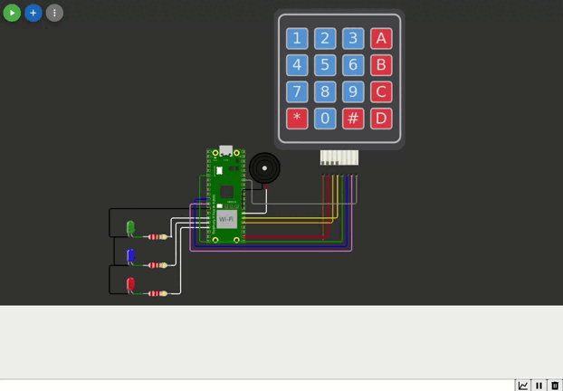

<h1 align="center">Controle de Pinos GPIO com Teclado Matricial</h1>

## Sumário

- [Sumário](#sumário)
- [Descrição](#descrição)
- [Funcionalidades Implementadas](#funcionalidades-implementadas)
- [Componentes Utilizados](#componentes-utilizados)
- [Objetivos](#objetivos)
- [Passos para Implementação](#passos-para-implementação)
- [Instruções de Uso](#instruções-de-uso)
- [Testes](#testes)
  - [1. Acendendo as cores do LED individualmente](#1-acendendo-as-cores-do-led-individualmente)
  - [2. Acendendo todas as cores do LED simultaneamente](#2-acendendo-todas-as-cores-do-led-simultaneamente)
  - [3. Acendendo as cores do LED alternadamente](#3-acendendo-as-cores-do-led-alternadamente)
  - [4. Acendendo o pisca](#4-acendendo-o-pisca)
  - [5. Ativando o buzzer](#5-ativando-o-buzzer)
  - [Testes no Hardware](#testes-no-hardware)
  - [Resultados gerais](#resultados-gerais)
- [Vídeo Ensaio](#vídeo-ensaio)
- [Formação da Equipe](#formação-da-equipe)
- [Licença](#licença)

## Descrição

Este projeto controla pinos GPIO de um microcontrolador RP2040, presente na placa de desenvolvimento Raspberry Pi Pico W, utilizando um teclado matricial 4x4. O sistema permite o acionamento de LED RGB e um buzzer, com funcionalidades adicionais, incluindo modos especiais de piscar LED.

## Funcionalidades Implementadas

- **Acionamento de LEDs RGB:**
  - Tecla 2: Liga o LED verde.
  - Tecla 3: Liga o LED azul.
  - Tecla 5: Liga o LED vermelho.
  - Tecla 6: Liga todos os LEDs.
  - Tecla 0: Desliga todos os LEDs.
- **Controle do Buzzer:**
  - Tecla #: Ativa o buzzer com cinco beeps.
- **Modos Especiais:**
  - Tecla 8: Pisca todos os LEDs juntos cinco vezes.
  - Tecla 9: Pisca os LEDs alternadamente em sequência (verde, azul, vermelho) por cinco ciclos.

## Componentes Utilizados

- **Teclado Matricial 4x4**: Um teclado de membrana 4x4 para entrada de dados.
- **LED RGB**: LED para indicar as ações realizadas, com as cores, conforme as teclas pressionadas.
- **Buzzer**: Componente para emitir um som, acionado por uma tecla específica.
- **Microcontrolador Raspberry Pi Pico W**: O microcontrolador responsável pelo controle dos pinos GPIO.

## Objetivos

- Acionar as cores do LED RGB conforme as teclas '2', '3' e '5'.
- Controlar a emissão de som do buzzer ao pressionar a tecla '#'.

## Passos para Implementação

1. **Configuração dos Pinos**: Configuração dos pinos GPIO do Raspberry Pi Pico W para o teclado matricial, LEDs e buzzer.
2. **Leitura do Teclado**: Implementação de uma função para escanear o teclado matricial e identificar as teclas pressionadas.
3. **Controle dos LEDs**: Os LEDs são acionados de acordo com a tecla pressionada.
4. **Controle do Buzzer**: O buzzer é ativado, emitindo som, ao pressionar a tecla '#'.

## Instruções de Uso

1. **Instalar o VS Code e o Pico SDK**: Caso ainda não tenha, instale o Visual Studio Code e o Pico SDK para compilar e carregar o código no Raspberry Pi Pico W.
2. **Configurar o Ambiente de Desenvolvimento**:

   - Clone o repositório com o seguinte comando:
     ```bash
     git clone https://github.com/ferreiiratech/embarcatech-subgrupo-06-microcontroladores-gpio.git
     ```
   - Abra o projeto no VS Code.
   - Entre na pasta build através do terminal e execute os comandos a seguir:
     ```bash
     & cmake -G Ninja ..
     & ninja
     ```

3. **Simulação no Wokwi**:
   - Use o simulador online Wokwi para testar o projeto sem hardware físico. Acesse o simulador [aqui](https://wokwi.com/projects/420344440238547969).
4. **Carregar o Código no Raspberry Pi Pico W**:
   - Conecte a placa Raspberry Pi Pico W ao seu computador.
   - Compile o código e faça o upload para o microcontrolador usando o VS Code.
5. **Interação com o Sistema**:
   - Ao pressionar as teclas **2**, **3**, e **5**, o LED RGB mostra uma cor diferente.
   - Ao pressionar a tecla **#**, o buzzer emitirá um som.

# Testes do Sistema

A equipe implementou testes básicos para garantir o funcionamento correto dos componentes (teclado, LED e buzzer). Todos os testes foram realizados no simulador Wokwi e na placa Raspberry Pi Pico W.

## Testes Realizados

---

### 1. Acendendo as cores do LED individualmente

- **Descrição:** Verifica se as cores do LED, verde, azul e vermelho, podem ser acendidas individualmente ao pressionar as teclas correspondentes.
- **Passos:**
  1. Pressione a tecla `2` para ligar o LED verde.
  2. Pressione a tecla `3` para ligar o LED azul.
  3. Pressione a tecla `5` para ligar o LED vermelho.
  4. Pressione a tecla `0` para desligar as cores do LED.
- **Resultado:** Cada LED acendeu corretamente e foi desligado ao pressionar `0`.

  **Teste no Simulador:**  
    

  **Teste no Hardware:**  
  

---

### 2. Acendendo todas as cores do LED simultaneamente

- **Descrição:** Verifica se todas as cores do LED acendem ao mesmo tempo, resultando na cor branca, ao pressionar a tecla `6`.
- **Passos:**
  1. Pressione a tecla `6` para acender a cor branca no LED.
  2. Pressione a tecla `0` para desligar todas as cores do LED.
- **Resultado:** Todas as cores do LED acenderam simultaneamente, resultando na cor branca, e foram desligadas ao pressionar `0`.

  **Teste no Simulador:**  
    

  **Teste no Hardware:**  
  

---

### 3. Acendendo as cores do LED alternadamente

- **Descrição:** Verifica se as cores do LED alternam em sequência ao pressionar a tecla `9`.
- **Passos:**
  1. Pressione a tecla `9` e observe a sequência de alternância:
     - LED verde acende, enquanto azul e vermelho estão apagados.
     - LED azul acende, enquanto verde e vermelho estão apagados.
     - LED vermelho acende, enquanto verde e azul estão apagados.
  2. O ciclo se repete cinco vezes.
- **Resultado:** As cores do LED alternaram corretamente em sequência por cinco ciclos.

  **Teste no Simulador:**  
    

  **Teste no Hardware:**  
  

---

### 4. Acendendo o pisca

- **Descrição:** Verifica se todas as cores do LED piscam simultaneamente ao pressionar a tecla `8`.
- **Passos:**
  1. Pressione a tecla `8` e observe o comportamento:
     - Todas as cores do LED acendem juntas e depois apagam.
     - O ciclo de piscar se repete cinco vezes.
- **Resultado:** Todas as cores do LED piscaram simultaneamente, resultando na cor branca acendendo e apagando conforme o esperado.

  **Teste no Simulador:**  
    

  **Teste no Hardware:**  
  

---

### 5. Ativando o buzzer

- **Descrição:** Verifica se o buzzer emite som corretamente ao pressionar a tecla `#`.
- **Passos:**
  1. Pressione a tecla `#` e observe:
     - O buzzer emite cinco bipes consecutivos, cada um com 200ms de duração.
- **Resultado:** O buzzer emitiu os bipes conforme o esperado.
  - Teste no Simulador: [Veja o vídeo no YouTube](https://www.youtube.com/watch?v=uAZL45Uuh_U)
  - Teste no Hardware: [Veja o vídeo no YouTube](https://youtu.be/zUgdY5XnZsk)

---

## Resultados Gerais

- Todos os testes foram concluídos com sucesso tanto no simulador Wokwi quanto na placa Raspberry Pi Pico W.
- Os arquivos de demonstração podem ser encontrados na pasta [`docs/`](docs/).

## Vídeo Ensaio

Um vídeo ensaio de até 3 minutos demonstrando o funcionamento do projeto pode ser visualizado [aqui](https://www.dropbox.com/scl/fi/k9m5nmvstxah57ag2ah7c/test-all.mp4?rlkey=x65cjpvh3a8fxn5h4dw411jmu&st=mp245ijy&dl=0).

## Formação da Equipe

- **Líder do Projeto**: Leonardo Ferreira
- **Desenvolvedores**:
  - Yasmin Cordeiro de Souza Meira
  - Arthur Saldanha Félix Ulisses
  - Adão Thalisson Castro Guimarães
  - Nicole Rocha
  - João Felipe Teles Monte

## Licença

Este projeto está licenciado sob a licença MIT.