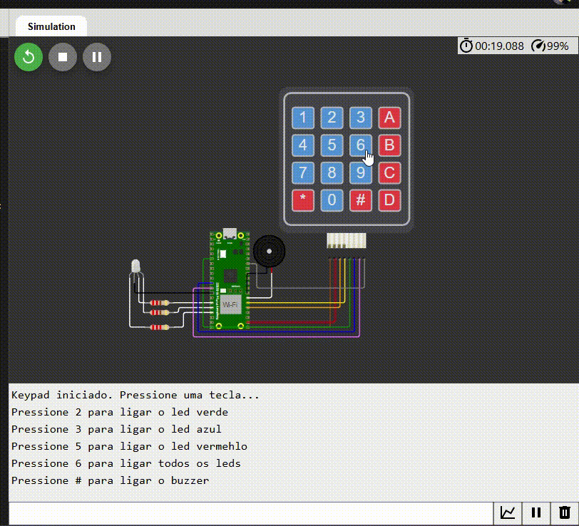
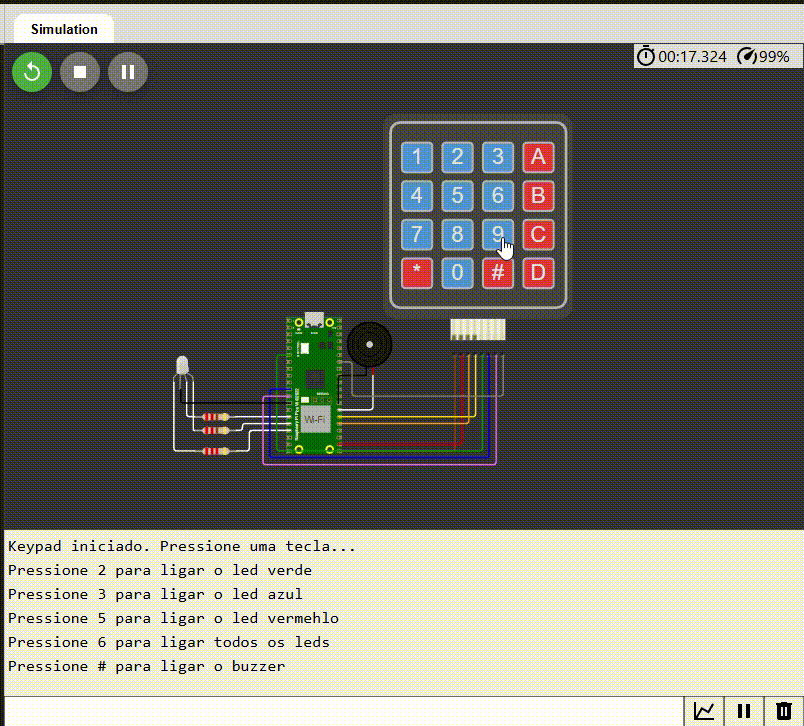
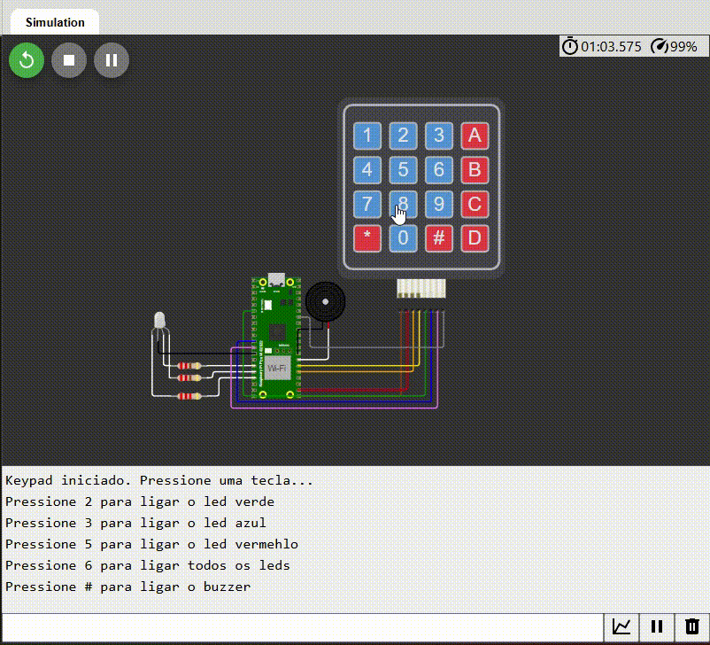

<h1 align="center">Controle de Pinos GPIO com Teclado Matricial</h1>

## Sumário

1. [Descrição](#descrição)  
2. [Funcionalidades Implementadas](#funcionalidades-implementadas)  
3. [Componentes Utilizados](#componentes-utilizados)  
4. [Objetivos](#objetivos)  
5. [Passos para Implementação](#passos-para-implementação)   
6. [Instruções de Uso](#instruções-de-uso)  
7. [Testes](#testes)  
8. [Vídeo-Ensaio](#video-ensaio)  
9. [Formação da Equipe](#formação-da-equipe)  
10. [Licença](#licença)  

## Descrição

Este projeto controla pinos GPIO de um microcontrolador RP2040, presente na placa de desenvolvimento Raspberry Pi Pico W, utilizando um teclado matricial 4x4. O sistema permite o acionamento de LEDs RGB e um buzzer, com funcionalidades adicionais, incluindo modos especiais de piscar LEDs.

## Funcionalidades Implementadas

- **Acionamento de LEDs RGB:**
    - Tecla 2: Liga o LED verde.
    - Tecla 3: Liga o LED azul.
    - Tecla 5: Liga o LED vermelho.
    - Tecla 6: Liga todos os LEDs.
    - Tecla 0: Desliga todos os LEDs.
- **Controle do Buzzer:**
    - Tecla #: Ativa o buzzer com cinco beeps.
- **Modos Especiais:**
    - Tecla 8: Pisca todos os LEDs juntos cinco vezes.
    - Tecla 9: Pisca os LEDs alternadamente em sequência (verde, azul, vermelho) por cinco ciclos.

## Componentes Utilizados

- **Teclado Matricial 4x4**: Um teclado de membrana 4x4 para entrada de dados.
- **3 LEDs RGB**: LEDs para indicar as ações realizadas conforme as teclas pressionadas.
- **Buzzer**: Componente para emitir um som, acionado por uma tecla específica.
- **Microcontrolador Raspberry Pi Pico W**: O microcontrolador responsável pelo controle dos pinos GPIO.

## Objetivos

- Acionar 3 LEDs RGB conforme as teclas 'A', 'B' e 'C'.
- Controlar a emissão de som do buzzer ao pressionar a tecla '#'.
- Reproduzir uma melodia ao pressionar uma tecla específica.

## Passos para Implementação

1. **Configuração dos Pinos**: Configuração dos pinos GPIO do Raspberry Pi Pico W para o teclado matricial, LEDs e buzzer.
2. **Leitura do Teclado**: Implementação de uma função para escanear o teclado matricial e identificar as teclas pressionadas.
3. **Controle dos LEDs**: Os LEDs são acionados de acordo com a tecla pressionada.
4. **Controle do Buzzer**: O buzzer é ativado ao pressionar a tecla '#'.
5. **Reprodução de Música**: Ao pressionar uma tecla específica, uma melodia é tocada com o buzzer.

## Instruções de Uso

1. **Instalar o VS Code e o Pico SDK**: Caso ainda não tenha, instale o Visual Studio Code e o Pico SDK para compilar e carregar o código no Raspberry Pi Pico W.
   
2. **Configurar o Ambiente de Desenvolvimento**:
   - Clone o repositório com o seguinte comando:
     ```bash
     git clone https://github.com/ferreiiratech/embarcatech-subgrupo-06-microcontroladores-gpio.git
     ```
   - Abra o projeto no VS Code.
   - Entre na pasta build através do terminal e execute os comandos a seguir:
     ```bash
     & cmake -G Ninja ..
     & ninja
     ```

3. **Simulação no Wokwi**:
   - Use o simulador online Wokwi para testar o projeto sem hardware físico. Acesse o simulador [aqui](https://wokwi.com/projects/420344440238547969).
   
4. **Carregar o Código no Raspberry Pi Pico W**:
   - Conecte a placa Raspberry Pi Pico W ao seu computador.
   - Compile o código e faça o upload para o microcontrolador usando o VS Code.
   
5. **Interação com o Sistema**:
   - Ao pressionar as teclas **A**, **B**, e **C**, os LEDs RGB .
   - Ao pressionar a tecla **#**, o buzzer emitirá um som.

## Testes

A equipe implementou testes básicos para garantir que cada componente (teclado, LEDs e buzzer) funcione corretamente. Todos os testes foram realizados no simulador Wokwi e também na placa Raspberry Pi Pico W.

Os testes realizados foram:

### 1. Acendendo os LEDs Individualmente
- **Descrição:** Verifica se os LEDs verde, azul e vermelho podem ser acendidos individualmente ao pressionar as teclas correspondentes.
- **Passos:**
  1. Pressione a tecla `2` para ligar o LED verde.
  2. Pressione a tecla `3` para ligar o LED azul.
  3. Pressione a tecla `5` para ligar o LED vermelho.
  4. Pressione a tecla `0` para desligar todos os LEDs.
- **Resultado:** Cada LED acendeu corretamente e foi desligado ao pressionar `0`.
- 

---

### 2. Acendendo Todos os LEDs Simultaneamente
- **Descrição:** Verifica se todos os LEDs acendem ao mesmo tempo ao pressionar a tecla `6`.
- **Passos:**
  1. Pressione a tecla `6` para acender todos os LEDs.
  2. Pressione a tecla `0` para desligar todos os LEDs.
- **Resultado:** Todos os LEDs acenderam simultaneamente e foram desligados ao pressionar `0`.
- 

---

### 3. Acendendo os LEDs Alternadamente
- **Descrição:** Verifica se os LEDs alternam entre acender e apagar em sequência ao pressionar a tecla `9`.
- **Passos:**
  1. Pressione a tecla `9` e observe a sequência de alternância:
     - LED verde acende, enquanto azul e vermelho estão apagados.
     - LED azul acende, enquanto verde e vermelho estão apagados.
     - LED vermelho acende, enquanto verde e azul estão apagados.
  2. O ciclo se repete cinco vezes.
- **Resultado:** Os LEDs alternaram corretamente em sequência por cinco ciclos.
- 

---

### 4. Acendendo o Pisca
- **Descrição:** Verifica se todos os LEDs piscam simultaneamente ao pressionar a tecla `8`.
- **Passos:**
  1. Pressione a tecla `8` e observe o comportamento:
     - Todos os LEDs acendem juntos e depois apagam.
     - O ciclo de piscar se repete cinco vezes.
- **Resultado:** Todos os LEDs piscaram simultaneamente conforme o esperado.
- 

---

### 5. Ativando o Buzzer
- **Descrição:** Verifica se o buzzer emite som corretamente ao pressionar a tecla `#`.
- **Passos:**
  1. Pressione a tecla `#` e observe:
     - O buzzer emite cinco bipes consecutivos, cada um com 200ms de duração.
- **Resultado:** O buzzer emitiu os bipes conforme o esperado.
- 

---

### 6. Restrições de Interação
- **Descrição:** Verifica se o sistema responde apenas às teclas permitidas (`2`, `3`, `5`, `6`, `8`, `9`, `#`, `0`) e ignora teclas inválidas.
- **Passos:**
  1. Pressione qualquer tecla fora das permitidas (por exemplo, `1`, `4`, `7`, `A`, `B`, `C`, `D`, `*`).
  2. Observe se o sistema exibe uma mensagem de "tecla inválida" e não realiza nenhuma ação.
- **Resultado:** Apenas as teclas permitidas produziram ações; teclas inválidas foram ignoradas com mensagens de erro.
- 

---

### Resultados Gerais
- Todos os testes foram concluídos com sucesso tanto no simulador Wokwi quanto na placa Raspberry Pi Pico W.
- Os GIFs demonstrando os testes podem ser encontrados na pasta [`docs/`](docs/).


## Vídeo Ensaio

Um vídeo ensaio de até 3 minutos demonstrando o funcionamento do projeto pode ser visualizado [aqui](https://www.dropbox.com/scl/fi/va5dp18ahzarjyd6z8boh/2025-01-09-16-29-53.mkv?rlkey=j93icbgjf3m080d1tyde33fxz&dl=0).

## Formação da Equipe

- **Líder do Projeto**: [Nome do Líder]
- **Desenvolvedores**:
  - Yasmin Cordeiro de Souza Meira
  - Arthur Saldanha Félix Ulisses
  - [Nome do Desenvolvedor 3]
  - [Nome do Desenvolvedor 4]
  - [Nome do Desenvolvedor 5]

## Licença

Este projeto está licenciado sob a licença MIT.


